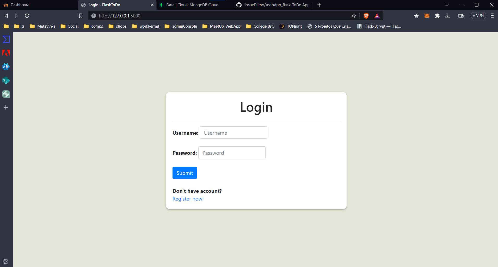
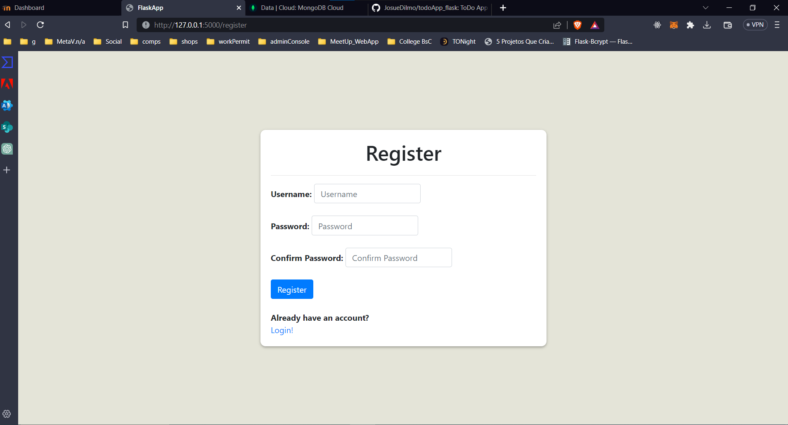
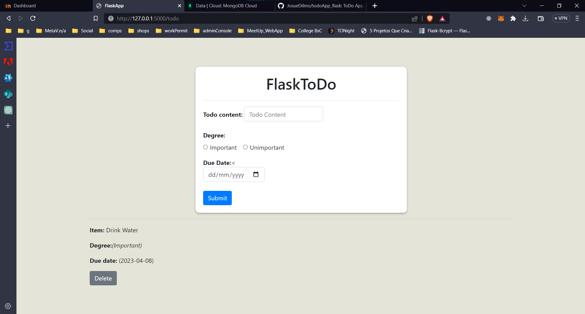
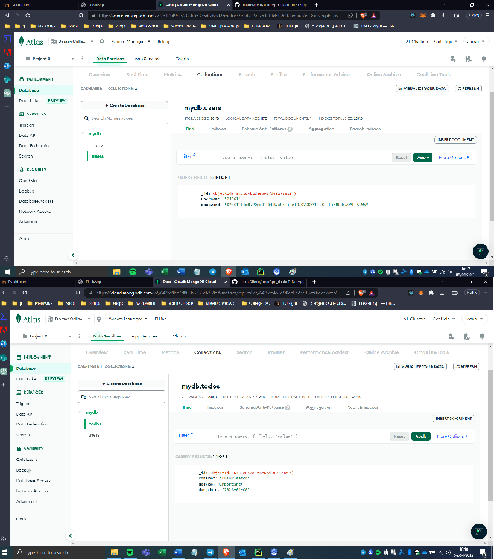

# Flask TODO App
This is a Flask application that allows users to create and delete TODO items.  
The application uses MongoDB Atlas to store the TODO items and USERS.
To use the application, users must first register by providing a username and password. 
The password is hashed using Flask-Bcrypt before being stored in the database for security.  
After registering, users can log in using their username and password to access their todo list.

## Installation
To run the application, you will need to install Python 3.x and the following packages:

- Flask
- pymongo
- bcrypt

You can install the packages using pip.

bash  
`pip install flask pymongo bson flask-bcrypt`

# Configuration
The application uses MongoDB Atlas as the database.   
You will need to create a database on MongoDB Atlas and obtain a connection string.  
Update the client variable in app.py with your connection string. 

python 
`client = MongoClient('mongodb+srv://<username>:<password>@cluster0.kjtwkrj.mongodb.net/?retryWrites=true&w=majority')`

# Usage
To run the application, execute the following command in the terminal:

bash
`python app.py`  
The application will be available at http://localhost:5000.  
You can create an account using username and password.
You can login to your account and access your TODO items.
You can create new TODO items by entering the content and selecting the degree of importance. 
You can delete TODO items by clicking on the delete button next to each item. 

## Application running:
<i>I also added a video at ./media/todoApp.mp4.</i>

  

  

  

  

## References
- [How To Use MongoDB in a Flask Application](https://www.digitalocean.com/community/tutorials/how-to-use-mongodb-in-a-flask-application)
- [Flask-Bcrypt](https://flask-bcrypt.readthedocs.io/en/1.0.1/)
- [Bootstrap](https://getbootstrap.com/docs/5.3/getting-started/introduction/)
- [Flask video](https://www.youtube.com/watch?v=xjHEcmjlD-Y&t=493s)
- [Flask Auth video](https://www.youtube.com/watch?v=71EU8gnZqZQ)
