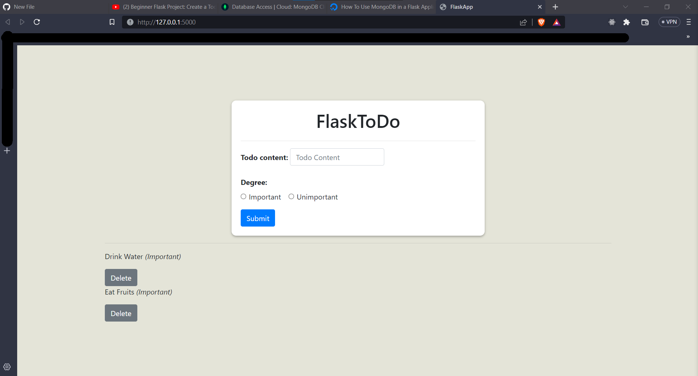
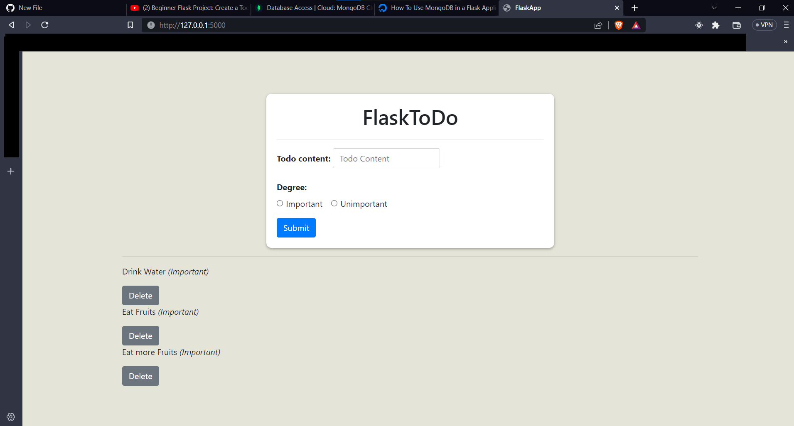
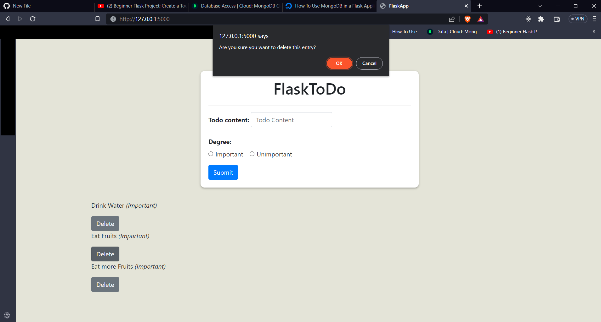
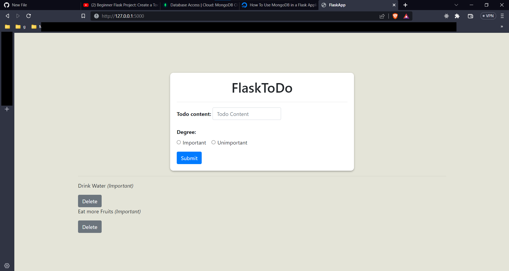

# Flask TODO App
This is a Flask application that allows users to create and delete TODO items.  
The application uses MongoDB Atlas to store the TODO items.

## Installation
To run the application, you will need to install Python 3.x and the following packages:

- Flask
- pymongo
You can install the packages using pip.

bash  
`pip install flask pymongo bson`

# Configuration
The application uses MongoDB Atlas as the database.   
You will need to create a database on MongoDB Atlas and obtain a connection string.  
Update the client variable in app.py with your connection string. 

python 
``client = MongoClient('mongodb+srv://<username>:<password>@cluster0.kjtwkrj.mongodb.net/<database>?retryWrites=true&w=majority')`

# Usage
To run the application, execute the following command in the terminal:

bash
`python app.py`
The application will be available at http://localhost:5000.  
You can create new TODO items by entering the content and selecting the degree of importance. 
You can delete TODO items by clicking on the delete button next to each item. 

## Application running:

  

  

  

  

## References
- [How To Use MongoDB in a Flask Application](https://www.digitalocean.com/community/tutorials/how-to-use-mongodb-in-a-flask-application)
- [Bootstrap](https://getbootstrap.com/docs/5.3/getting-started/introduction/)
- [Flask video](https://www.youtube.com/watch?v=xjHEcmjlD-Y&t=493s)
